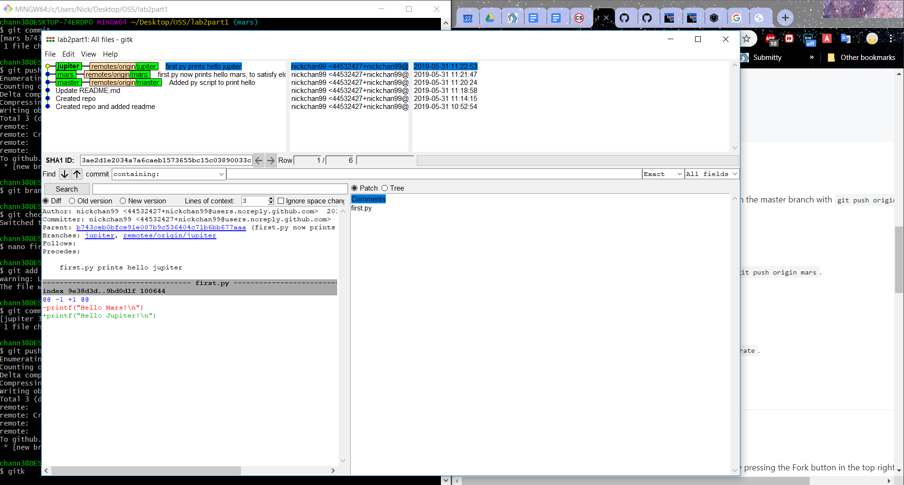
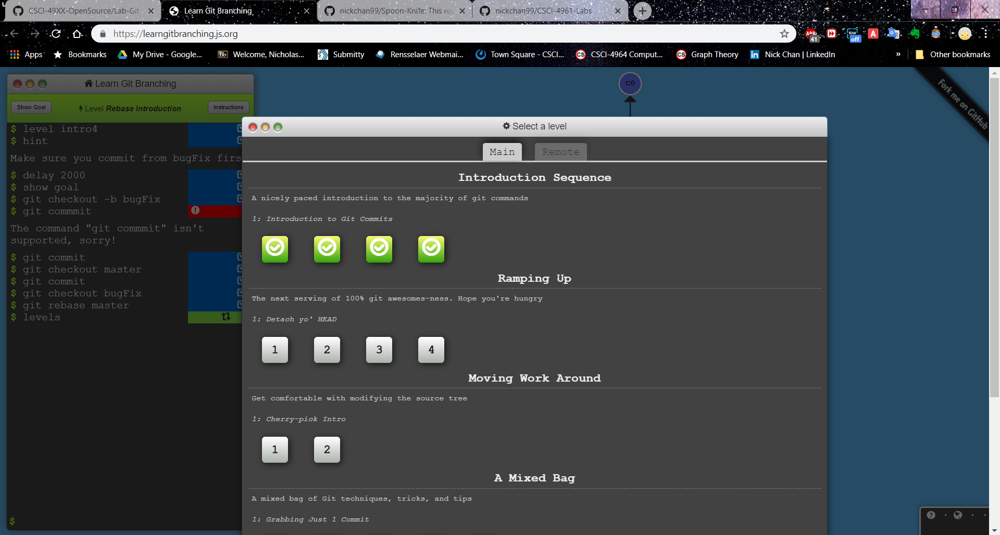

lab2part1 link: https://github.com/nickchan99/lab2part1/

Gitk output: 

Gitk --All output: 

Git log output: 

Spoon-Knife fork: https://github.com/nickchan99/Spoon-Knife/

Learn Git Branching: 

PullReq fork: https://github.com/nickchan99/PullReq

Git diff output:

Git tag output:

OSSProjectIdeas link: https://github.com/benjaminrsherman/OSSProjectIdeas
