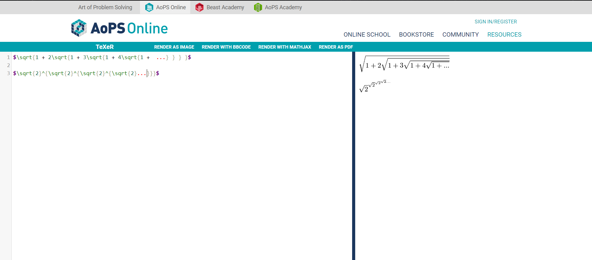
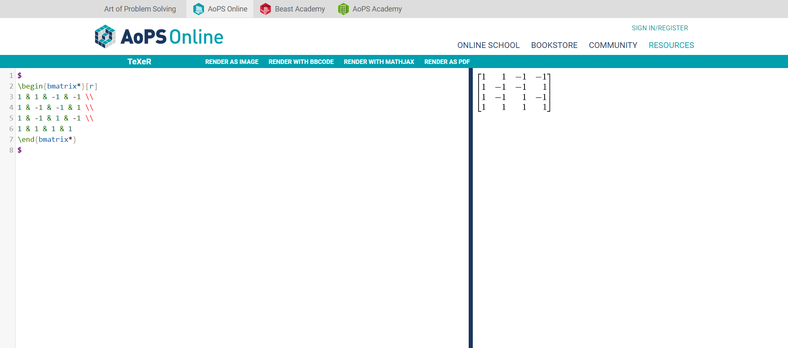

Lab 3 Report:

Part 1:
1) See CSCI-4961-Labs Wiki page.

2) LaTeX for generating the given formulae:

3) LaTeX for generating a Hadamard Matrix (bmatrix is the best TeX matrix)

Part 2:

I analyzed Impac, a library for compressing images using C++. This project has 3 contributors, 102 commits, and 67,887 lines of code. The first commit was an initial commmit, and the commit immediately after that added the MIT license. The most recent commits ironed out some typos, and fixed some scripts. 5 branches exist. 1 is the master branch, and 4 branches after the names of contributors.

If found that compared to my friend's project, MagicVoice, Impac is far larger and more contributed to. This is most likely because of the larger number of regular contributors. MagicVoicing has 14 commits, while Impac has 102. Both projecfts are the same age.

My table (5) analyzed:

Impac:
LiveOut:
HowAreYou:
Hedgehogs:
HazelHeaters:
