# Lab 3 Report:

### Part 1:
1) See CSCI-4961-Labs Wiki page.

2) LaTeX for generating the given formulae:

3) LaTeX for generating a Hadamard Matrix (bmatrix is the best TeX matrix)

### Part 2:

I analyzed Impac, a library for compressing images using C++. This project has 3 contributors, 102 commits, and 67,887 lines of code. The first commit was an initial commmit, and the commit immediately after that added the MIT license. The most recent commits ironed out some typos, and fixed some scripts. 5 branches exist. 1 is the master branch, and 4 branches after the names of contributors.

I found that when I ran:
> git ls-files -z | xargs -0 wc -l
it was reported that impac contained 67,877 lines, but Git Stats shows that the project contains 44,441. Additionally, GitStats lists more developers than the contributers Github reports.

Git stats for Impac:
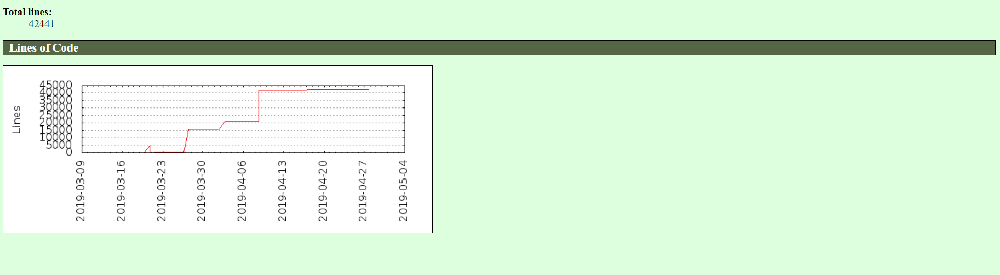
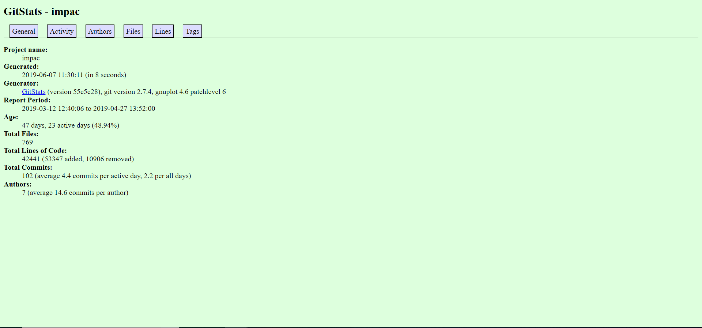

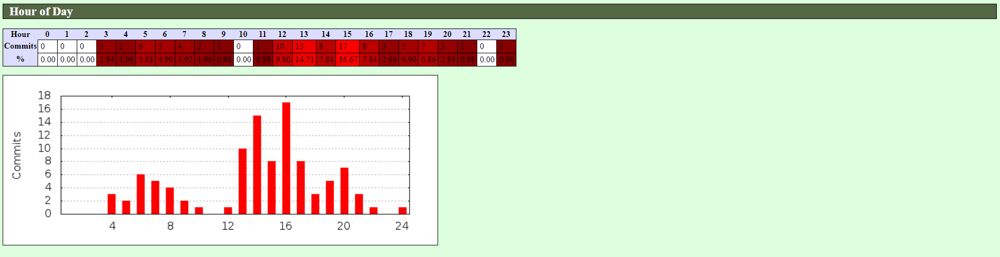
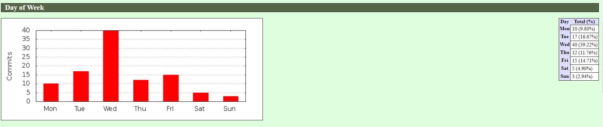

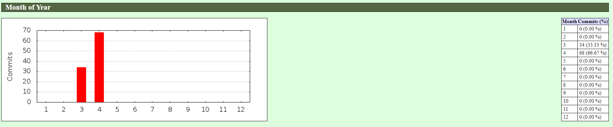
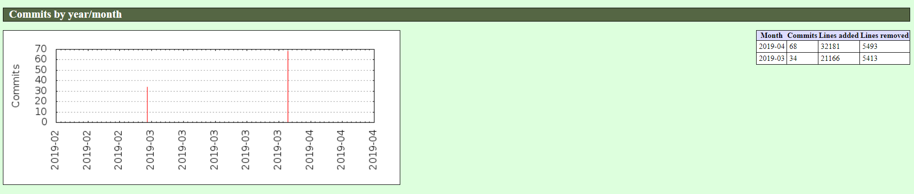
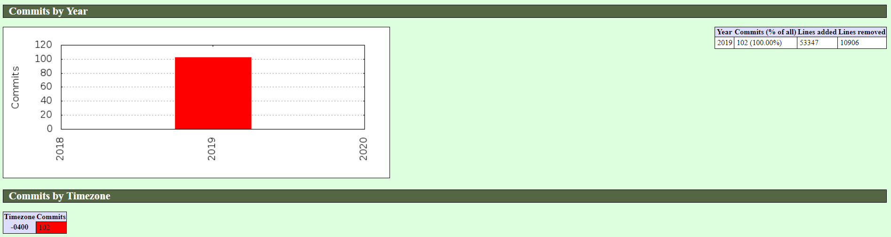
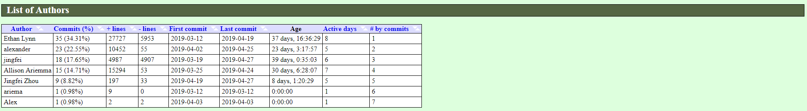
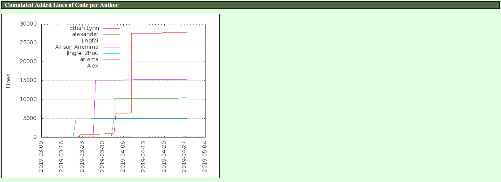
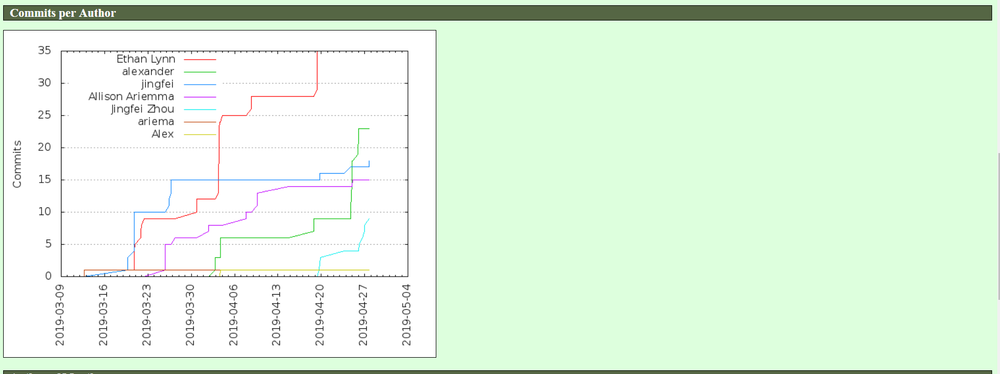

My group (group 5) analyzed:

Impac: 44,441 lines of code, 102 commits, 7 total contributors

LiveOut: 19953 lines of code, 1 contributor, and only 1 branch (master).

How Are You?: 31,303 lines, 2 contributors.

Hedgehogs: 223364 lines of code, 251 commits, 16 contributors, 13 branches.

HazelHeaters: 16 commits, 1 branch, 2 contributors.

### Part 3: 

I know it was reccomened that Goruce not be installed on WSL, but I attempted it. As it turns out,

> ffmpeg -y -r 60 -f image2pipe -vcodec ppm -i gource.ppm  -vcodec mpeg4 -b:v 3000k -s hd480 gource.mp4

generated an mp4 just fine as long as ffmpeg is installed. 

> gource -1280x720 -o gource.ppm --time-scale 3

didn't seem to work though. Once the mp4 is generated, it can be navigated to through the Windows filesystem and viewed with the built in video player.

Here is a snapshot from the seconds before the end of the Gource video:
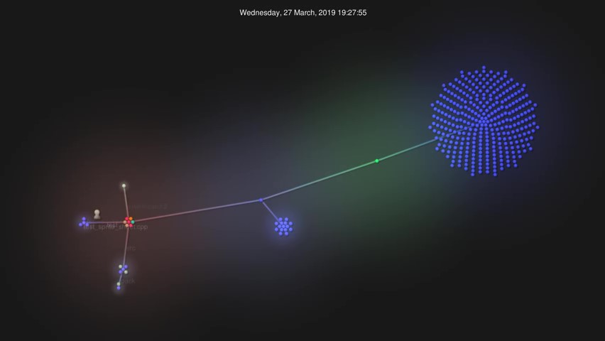
