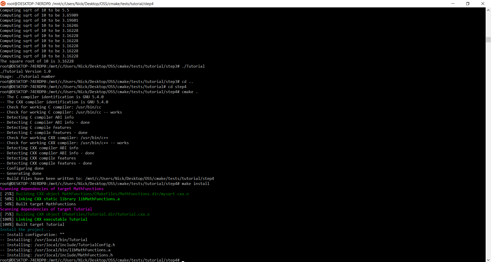

# Lab 5 - Build Systems

## CMake Tutorial:

#### Step 1


The CMakeLists file is:

https://github.com/nickchan99/CSCI-4961-Labs/blob/master/Lab5/Step1_Results/CMakeLists.txt

#### Step 2


The CMakeLists file is:

https://github.com/nickchan99/CSCI-4961-Labs/blob/master/Lab5/Step2_Results/CMakeLists.txt

#### Step 3


The CMakeLists file is:

https://github.com/nickchan99/CSCI-4961-Labs/blob/master/Lab5/Step3_Results/CMakeLists.txt

The CMakeLists file for the MathFunctions directory is:

https://github.com/nickchan99/CSCI-4961-Labs/blob/master/Lab5/Step3_Results/CMakeLists(MathFunctions).txt

#### Step 4




The CMakeLists file is:

https://github.com/nickchan99/CSCI-4961-Labs/blob/master/Lab5/Step4_Results/CMakeLists.txt

The CMakeLists file for the MathFunctions directory is:

https://github.com/nickchan99/CSCI-4961-Labs/blob/master/Lab5/Step4_Results/CMakeLists(MathFunctions).txt

#### Step 5


The CMakeLists file is:

https://github.com/nickchan99/CSCI-4961-Labs/blob/master/Lab5/Step5_Results/CMakeLists.txt

The CMakeLists file for the MathFunctions directory is:

https://github.com/nickchan99/CSCI-4961-Labs/blob/master/Lab5/Step5_Results/CMakeLists(MathFunctions).txt

## Makefile Practice

Using one makefile to build two executables:

```
static_block: program.c libblockstatic.a
	gcc -Wall program.c -o static_block -L. -lblockstatic
dynamic_block: program.c libblockshared.so
	gcc -L. -Wl,-rpath=. -Wall program.c -o dynamic_block -lblockshared
libblockstatic.a: block.o headers/block.h
	ar rcs libblockstatic.a block.o headers/block.h
libblockshared.so: block.o headers/block.h
	gcc -shared block.o -o libblockshared.so 
block.o: source/block.c
	gcc -fPIC -c source/block.c -o block.o
libs: libblockstatic.a
clean:
	rm -f static_block dynamic_block *.o *.so *.a
```
This makefile specifies two target executables, static_block and dynamic_block. The compiler arguments for each are specified. The static library simply requires a link argument and -L flag to tell gcc where to look for the library. The dynamic library requires the rpath to be specified to the library, telling the compiler to link that shared library. Below are the targets for the dependancies. The shared library is compiled, but the static library is given files to archive. Lastly, block.o is specified, and compiled as a position independent object. A clean command is specified to enable an easier clean rebuild.

static_block is 8747 bytes, while dynamic_block is 8600 bytes.

## Makefile Practice using CMake

The makefile above can be emulated using CMake:

```
cmake_minimum_required(VERSION 3.3)
project(CMakeExample)

set(CMAKE_CXX_STANDARD 14)

add_library(blocklibstat STATIC source/block.c headers/block.h)
add_library(blocklibshar SHARED source/block.c headers/block.h)

list(APPEND STATIC_LIBS blocklibstat)
list(APPEND DYNAMIC_LIBS blocklibshar)

add_executable(static_block program.c)
add_executable(dynamic_block program.c)

target_link_libraries(static_block ${STATIC_LIBS})
target_link_libraries(dynamic_block ${DYNAMIC_LIBS})
```

We can add files to the required libraries, and specify whether or not they will be static or shared. Appending the libraries to load allows them to be linked with the executables we specified with add_executable(). 

And this generates the following makefile:

```
# CMAKE generated file: DO NOT EDIT!
# Generated by "Unix Makefiles" Generator, CMake Version 3.5

# Default target executed when no arguments are given to make.
default_target: all

.PHONY : default_target

# Allow only one "make -f Makefile2" at a time, but pass parallelism.
.NOTPARALLEL:


#=============================================================================
# Special targets provided by cmake.

# Disable implicit rules so canonical targets will work.
.SUFFIXES:


# Remove some rules from gmake that .SUFFIXES does not remove.
SUFFIXES =

.SUFFIXES: .hpux_make_needs_suffix_list


# Suppress display of executed commands.
$(VERBOSE).SILENT:


# A target that is always out of date.
cmake_force:

.PHONY : cmake_force

#=============================================================================
# Set environment variables for the build.

# The shell in which to execute make rules.
SHELL = /bin/sh

# The CMake executable.
CMAKE_COMMAND = /usr/bin/cmake

# The command to remove a file.
RM = /usr/bin/cmake -E remove -f

# Escaping for special characters.
EQUALS = =

# The top-level source directory on which CMake was run.
CMAKE_SOURCE_DIR = /mnt/c/Users/Nick/Desktop/OSS/Lab5-Lab-Example/combined_makefile_cmake

# The top-level build directory on which CMake was run.
CMAKE_BINARY_DIR = /mnt/c/Users/Nick/Desktop/OSS/Lab5-Lab-Example/combined_makefile_cmake

#=============================================================================
# Targets provided globally by CMake.

# Special rule for the target edit_cache
edit_cache:
	@$(CMAKE_COMMAND) -E cmake_echo_color --switch=$(COLOR) --cyan "No interactive CMake dialog available..."
	/usr/bin/cmake -E echo No\ interactive\ CMake\ dialog\ available.
.PHONY : edit_cache

# Special rule for the target edit_cache
edit_cache/fast: edit_cache

.PHONY : edit_cache/fast

# Special rule for the target rebuild_cache
rebuild_cache:
	@$(CMAKE_COMMAND) -E cmake_echo_color --switch=$(COLOR) --cyan "Running CMake to regenerate build system..."
	/usr/bin/cmake -H$(CMAKE_SOURCE_DIR) -B$(CMAKE_BINARY_DIR)
.PHONY : rebuild_cache

# Special rule for the target rebuild_cache
rebuild_cache/fast: rebuild_cache

.PHONY : rebuild_cache/fast

# The main all target
all: cmake_check_build_system
	$(CMAKE_COMMAND) -E cmake_progress_start /mnt/c/Users/Nick/Desktop/OSS/Lab5-Lab-Example/combined_makefile_cmake/CMakeFiles /mnt/c/Users/Nick/Desktop/OSS/Lab5-Lab-Example/combined_makefile_cmake/CMakeFiles/progress.marks
	$(MAKE) -f CMakeFiles/Makefile2 all
	$(CMAKE_COMMAND) -E cmake_progress_start /mnt/c/Users/Nick/Desktop/OSS/Lab5-Lab-Example/combined_makefile_cmake/CMakeFiles 0
.PHONY : all

# The main clean target
clean:
	$(MAKE) -f CMakeFiles/Makefile2 clean
.PHONY : clean

# The main clean target
clean/fast: clean

.PHONY : clean/fast

# Prepare targets for installation.
preinstall: all
	$(MAKE) -f CMakeFiles/Makefile2 preinstall
.PHONY : preinstall

# Prepare targets for installation.
preinstall/fast:
	$(MAKE) -f CMakeFiles/Makefile2 preinstall
.PHONY : preinstall/fast

# clear depends
depend:
	$(CMAKE_COMMAND) -H$(CMAKE_SOURCE_DIR) -B$(CMAKE_BINARY_DIR) --check-build-system CMakeFiles/Makefile.cmake 1
.PHONY : depend

#=============================================================================
# Target rules for targets named blocklibshar

# Build rule for target.
blocklibshar: cmake_check_build_system
	$(MAKE) -f CMakeFiles/Makefile2 blocklibshar
.PHONY : blocklibshar

# fast build rule for target.
blocklibshar/fast:
	$(MAKE) -f CMakeFiles/blocklibshar.dir/build.make CMakeFiles/blocklibshar.dir/build
.PHONY : blocklibshar/fast

#=============================================================================
# Target rules for targets named dynamic_block

# Build rule for target.
dynamic_block: cmake_check_build_system
	$(MAKE) -f CMakeFiles/Makefile2 dynamic_block
.PHONY : dynamic_block

# fast build rule for target.
dynamic_block/fast:
	$(MAKE) -f CMakeFiles/dynamic_block.dir/build.make CMakeFiles/dynamic_block.dir/build
.PHONY : dynamic_block/fast

#=============================================================================
# Target rules for targets named blocklibstat

# Build rule for target.
blocklibstat: cmake_check_build_system
	$(MAKE) -f CMakeFiles/Makefile2 blocklibstat
.PHONY : blocklibstat

# fast build rule for target.
blocklibstat/fast:
	$(MAKE) -f CMakeFiles/blocklibstat.dir/build.make CMakeFiles/blocklibstat.dir/build
.PHONY : blocklibstat/fast

#=============================================================================
# Target rules for targets named static_block

# Build rule for target.
static_block: cmake_check_build_system
	$(MAKE) -f CMakeFiles/Makefile2 static_block
.PHONY : static_block

# fast build rule for target.
static_block/fast:
	$(MAKE) -f CMakeFiles/static_block.dir/build.make CMakeFiles/static_block.dir/build
.PHONY : static_block/fast

program.o: program.c.o

.PHONY : program.o

# target to build an object file
program.c.o:
	$(MAKE) -f CMakeFiles/dynamic_block.dir/build.make CMakeFiles/dynamic_block.dir/program.c.o
	$(MAKE) -f CMakeFiles/static_block.dir/build.make CMakeFiles/static_block.dir/program.c.o
.PHONY : program.c.o

program.i: program.c.i

.PHONY : program.i

# target to preprocess a source file
program.c.i:
	$(MAKE) -f CMakeFiles/dynamic_block.dir/build.make CMakeFiles/dynamic_block.dir/program.c.i
	$(MAKE) -f CMakeFiles/static_block.dir/build.make CMakeFiles/static_block.dir/program.c.i
.PHONY : program.c.i

program.s: program.c.s

.PHONY : program.s

# target to generate assembly for a file
program.c.s:
	$(MAKE) -f CMakeFiles/dynamic_block.dir/build.make CMakeFiles/dynamic_block.dir/program.c.s
	$(MAKE) -f CMakeFiles/static_block.dir/build.make CMakeFiles/static_block.dir/program.c.s
.PHONY : program.c.s

source/block.o: source/block.c.o

.PHONY : source/block.o

# target to build an object file
source/block.c.o:
	$(MAKE) -f CMakeFiles/blocklibshar.dir/build.make CMakeFiles/blocklibshar.dir/source/block.c.o
	$(MAKE) -f CMakeFiles/blocklibstat.dir/build.make CMakeFiles/blocklibstat.dir/source/block.c.o
.PHONY : source/block.c.o

source/block.i: source/block.c.i

.PHONY : source/block.i

# target to preprocess a source file
source/block.c.i:
	$(MAKE) -f CMakeFiles/blocklibshar.dir/build.make CMakeFiles/blocklibshar.dir/source/block.c.i
	$(MAKE) -f CMakeFiles/blocklibstat.dir/build.make CMakeFiles/blocklibstat.dir/source/block.c.i
.PHONY : source/block.c.i

source/block.s: source/block.c.s

.PHONY : source/block.s

# target to generate assembly for a file
source/block.c.s:
	$(MAKE) -f CMakeFiles/blocklibshar.dir/build.make CMakeFiles/blocklibshar.dir/source/block.c.s
	$(MAKE) -f CMakeFiles/blocklibstat.dir/build.make CMakeFiles/blocklibstat.dir/source/block.c.s
.PHONY : source/block.c.s

# Help Target
help:
	@echo "The following are some of the valid targets for this Makefile:"
	@echo "... all (the default if no target is provided)"
	@echo "... clean"
	@echo "... depend"
	@echo "... edit_cache"
	@echo "... rebuild_cache"
	@echo "... blocklibshar"
	@echo "... dynamic_block"
	@echo "... blocklibstat"
	@echo "... static_block"
	@echo "... program.o"
	@echo "... program.i"
	@echo "... program.s"
	@echo "... source/block.o"
	@echo "... source/block.i"
	@echo "... source/block.s"
.PHONY : help


#=============================================================================
# Special targets to cleanup operation of make.

# Special rule to run CMake to check the build system integrity.
# No rule that depends on this can have commands that come from listfiles
# because they might be regenerated.
cmake_check_build_system:
	$(CMAKE_COMMAND) -H$(CMAKE_SOURCE_DIR) -B$(CMAKE_BINARY_DIR) --check-build-system CMakeFiles/Makefile.cmake 0
.PHONY : cmake_check_build_system
```
The sizes of the generated executables were exactly the same as the makefile that was written by hand (static_block: 8747 bytes, dynamic_block: 8600 bytes)

The result of running the executables is:


The resources below were useful for learning how to write CMake and Make files.

https://www.cprogramming.com/tutorial/shared-libraries-linux-gcc.html

https://mirkokiefer.com/cmake-by-example-f95eb47d45b1
