# Lab 6 - Virtualization

### Example00

I'm working on windows 10, so I installed docker toolbox. After setup finished, running 
`docker run docker/whalesay cowsay boo`
produced this output:
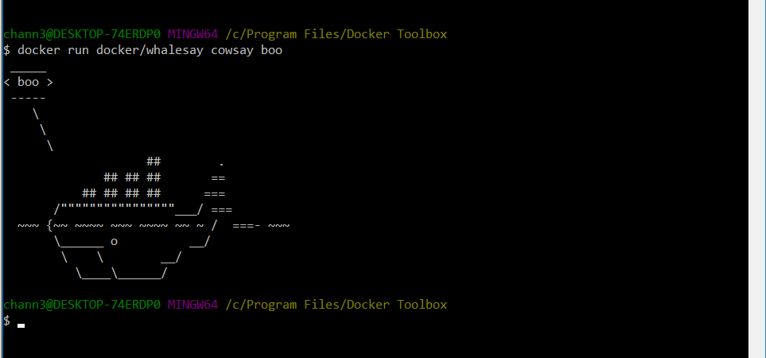

### Example01

Running `docker run -it ubuntu bash` and immediately updating packages with `apt update` gives the following output:
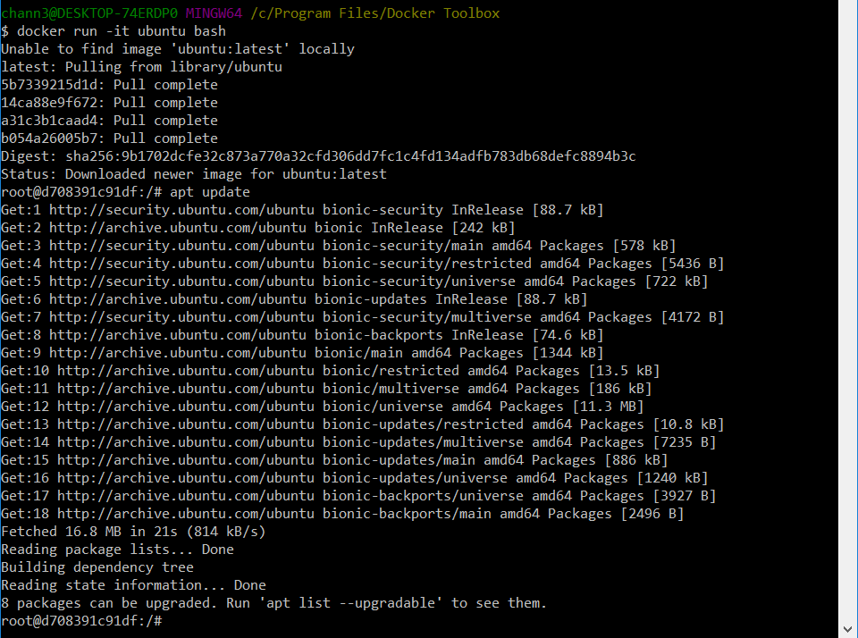

Installing vim works by running `apt install vim` and looks like:
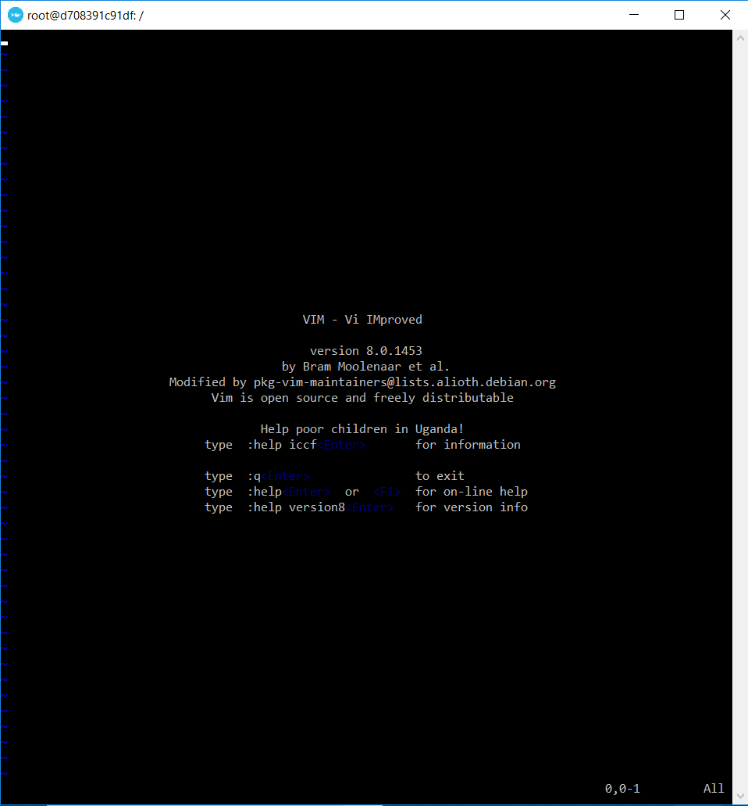

And installing cowsay and switching the user works by running `apt install cowsay` and then `su`, to give the output:
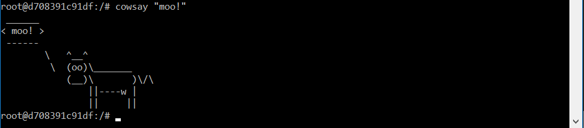

The Ubunutu bash can be exited with ctrl+d, which returns to docker toolbox.

### Example02

Downloading MongoDB and RocketChat:

`docker run --name db -d mongo:3.2 mongod --smallfiles`

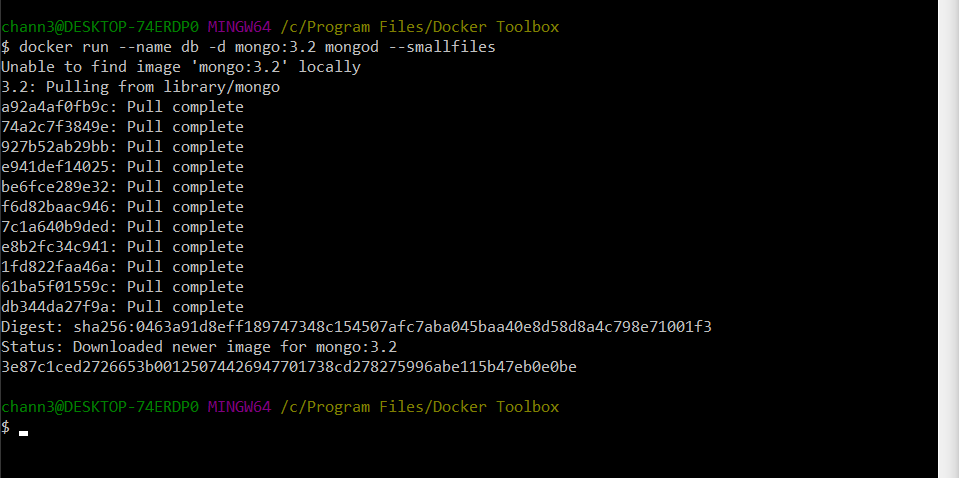

`docker run --name rocketchat -p 3000:3000 --env ROOT_URL=http://localhost --link db:db -d rocket.chat`  

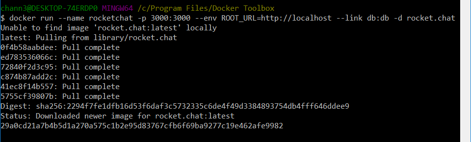

and we can see running containers using `docker ps`:

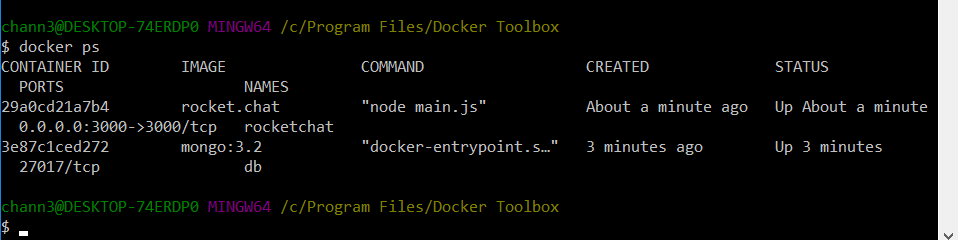

and images using `docker images`:

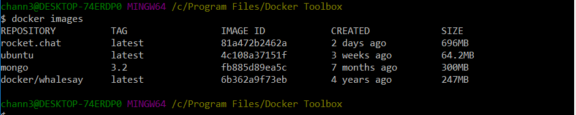

### Example03

The dockerfile used in the Readme is provided, so we can name it something like "mycontainer".

We can then build the container by entering `docker build -t mycontainer .` and then run the container using `docker run -p 5000:5000 mycontainer` which will display:

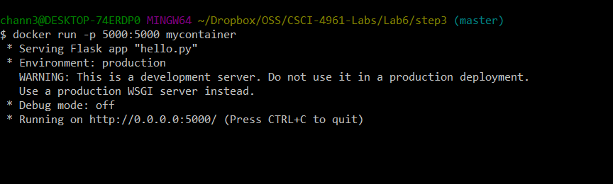

Which displays the message: "Hello RCOS members!" when accessing localhost:5000

### Example04

To build the messageApp, we need to create the Dockerfile with the given commands and run 
`docker build -t message-app .` On Windows 10, we need to delete node_modules since npm conflicts with files in that folder. Since npm install and npm audit fix are specified in the Dockerfile, this will be taken care of.

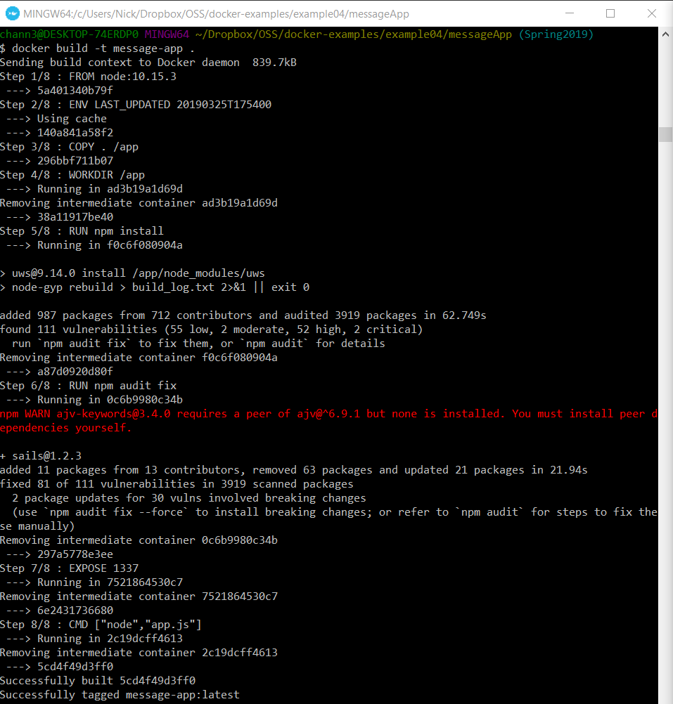

Running this spits out a MongoDB error:

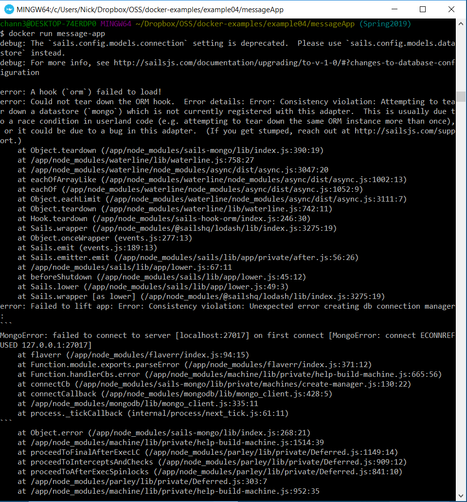

To fix this, we can create docker-compose.yml, and `run docker-compose build`. Once this finishes, we can run `docker-compose up`, which launches the message app:

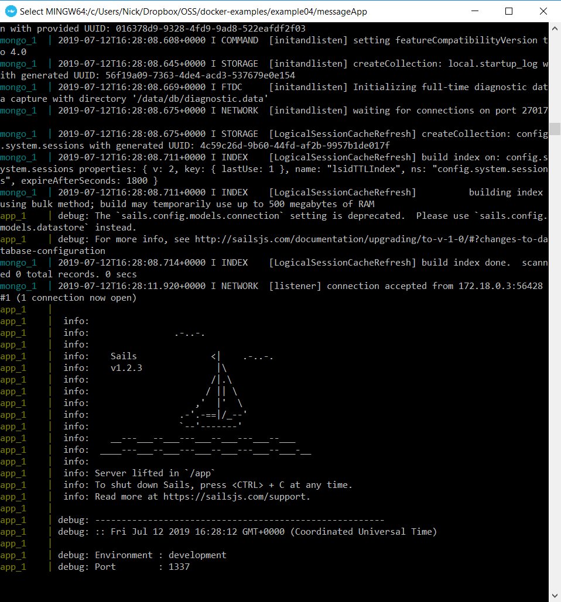

I could not get to view any of the docker apps in my browser, but after some searching online I found this: https://github.com/docker/for-win/issues/204#issuecomment-303461340.

So I went ahead and forwarded the ports in the VirtualBox instance, and it worked like a charm:

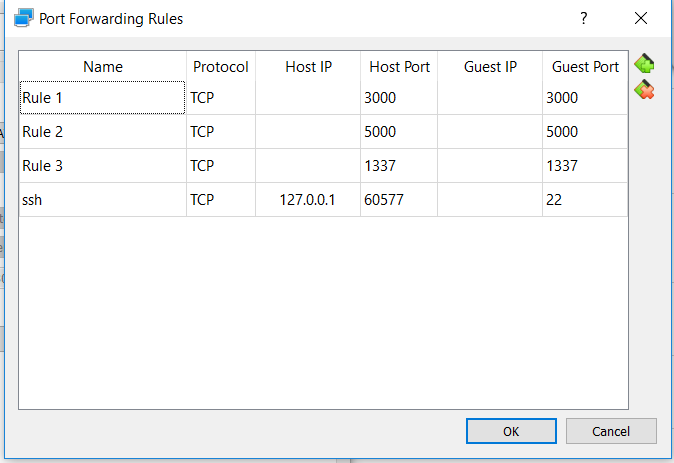

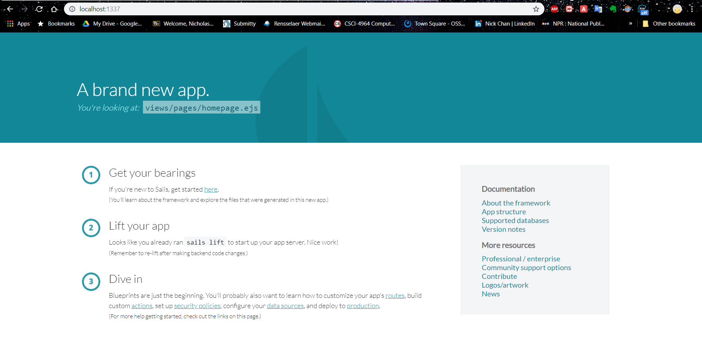

And we can interact with it from the terminal as well:

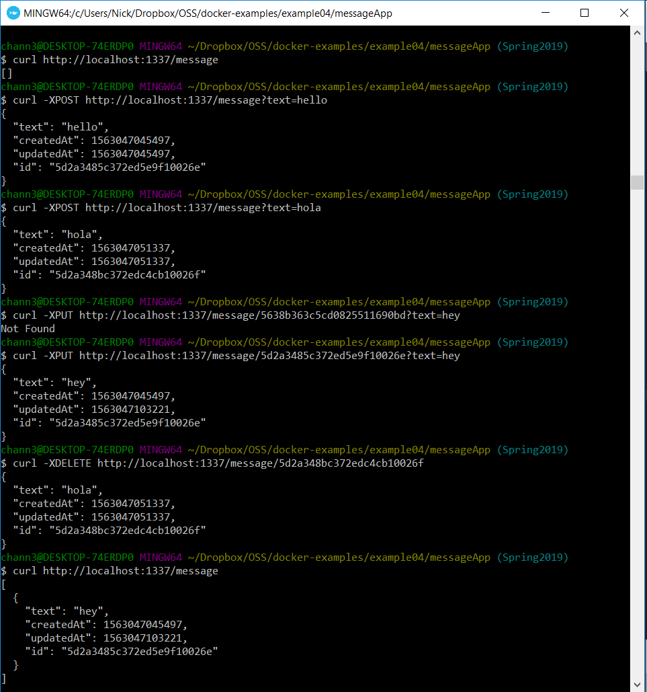
