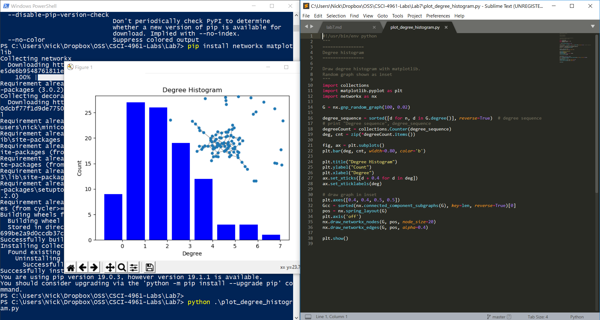
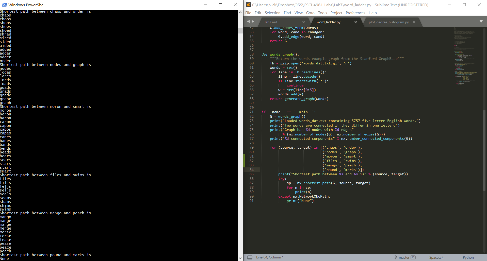
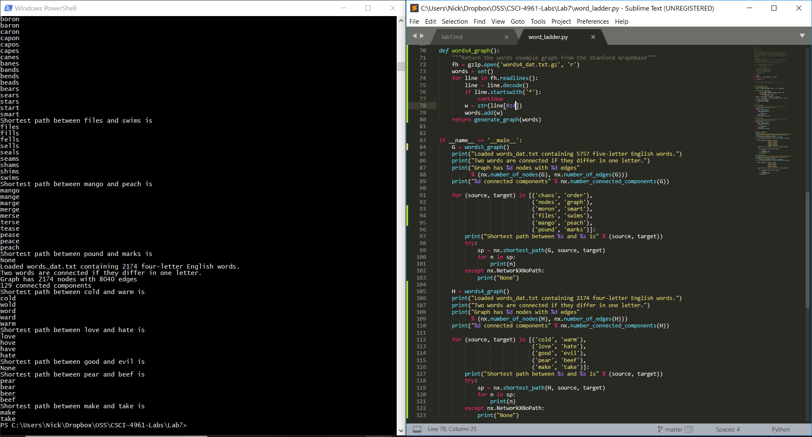
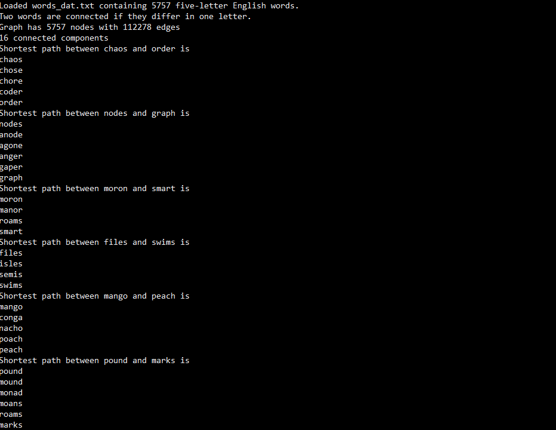
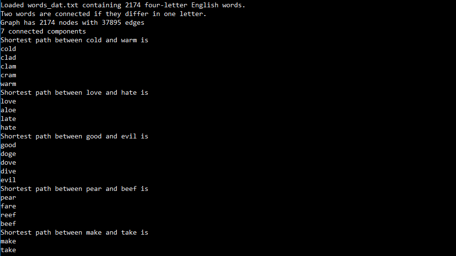

# Lab 7

### Part 1

I installed networkX and Matplotlib on Ubuntu using sudo apt install and tried running the example, but an error was constantly thrown saying 'int object is not iterable'. Instead I used Windows and installed both packages, and it ran and produced this graph:

It was also suggested that running python3 -m venv would install in a virtual enviornment, so that it wouldn't try and run a global installation of python.

To search for matches as described in the lab, we just needed to add 3 lines to the main method to search the graph. In my text editor, it was lines 81 - 83. This will run the graph shortest path algorithm to try and find a valid path. We can see that no path exists between pound and marks, so an exception is thrown, and the code prints None

### Part 2

To take 4 letter words, I copied the words_graph code and refactored it into two functions, words5_graph() and words4_graph(). The words5_graph() was the provided one, and I altered it to implemnet words4_graph(). I simply changed the filename to read from the correct zipfile, and I changed the assignment of variable w to be from indices 0 to 4, so that it wouldn't include the * that ends each word in the file. Next, I wrote a similar for loop to the provided one, so that it runs shortest path on the words provided. It produced the following output:

### Part 3

For the last part, we want to disregard the ordering of the words. For this, we can use itertools.permutation() to generate permutations of a given iterable. We can add a for loop to loop over permutations of 'word' to edit_distance_one(), so that it will try to edit words that are permutations of the word, allowing for different orderings. Additionally, we add an argument, "num" to the functions specifying the length of the word we want, so itertools.permutations() will only generate permutations of that length. This allows us to avoid checking single characer permutations and strings shorter than the length of the word we are dealing with. The permutaitons function actually generates r-tuples, so we convert it to a string using python's .join() function. edit_distance_one() is actually a generator, and will yield the words as it is called. This way, we can construct a graph with edges between words that differ by 1 character, regardless of order. Now, running shortest paths on the words again will yield:

and:

The code included in the repository will include code for the 4 letter solution, as well as the unordered solution. By comparison, the unordered solution graph has more than 4 times the edges that are in the 4 words orderd solution, and almost 8 times the edges of the 5 word ordered solution.