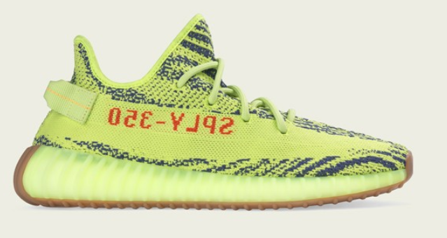

# Lab 9 - Tensorflow

### Part 1

After trying and failing to install `tensorflow-gpu` a few times, I settled on using the CPU version of tensorflow on native Windows 10, and installed it using pip3. Below is the plot that was generated:

### Part 2

While going through the install, we fitted and trained the model. The tutorial claimed that the model had a test accuracy of 0.8671, or 86.71%. When I ran the fitting, the test accuracy came back as 0.875, or 87.5%.  In the tutorial, we looked at the 0th image in the predictions array that was generated from the test images, an ankle boot. The ankle boot in the tutorial had a confidence of 80%, but my model had an accuracy of 92%:

But on the other hand, the tutorial's 12th predicted model is a sneaker, predicted with 61% confidence. My model had a 54% confidence on the same image:

And here is how the rest of the data compared to the tutorial's results:

When we add the ankle boot to its own predictions list, we can see how the confidence graph differs:

I re-ran the script when trying to modify the code to print 9000-9015, and the sneaker prediction from before was a higher confidence:

To modify the code, we let i loop over the range 9000 - 9015 and subtracting the third `.sublot()` argument by 9000, since that argument is the sub-image number. This genrates the following plot:

### Part 3

For my own test set, I picked a sleeveless workout top: 

Yeezy sneakers:

And a soccer jersey:

And the respective grayscale images:

I predicted that the jersey would be easily recognizable, but the other two would be trickier. I expected the workout top to be classified as something other than a t-shirt/top, and the sneaker to still be classified as a sneaker, but with a lower confidence due to its shape. The results were:

And I was surprised to see that the sleeveless shirt was correctly classified, although it had lower confidence. Additionally, it was surprising to see that the shoes were not classifed as sneakers at all. 
